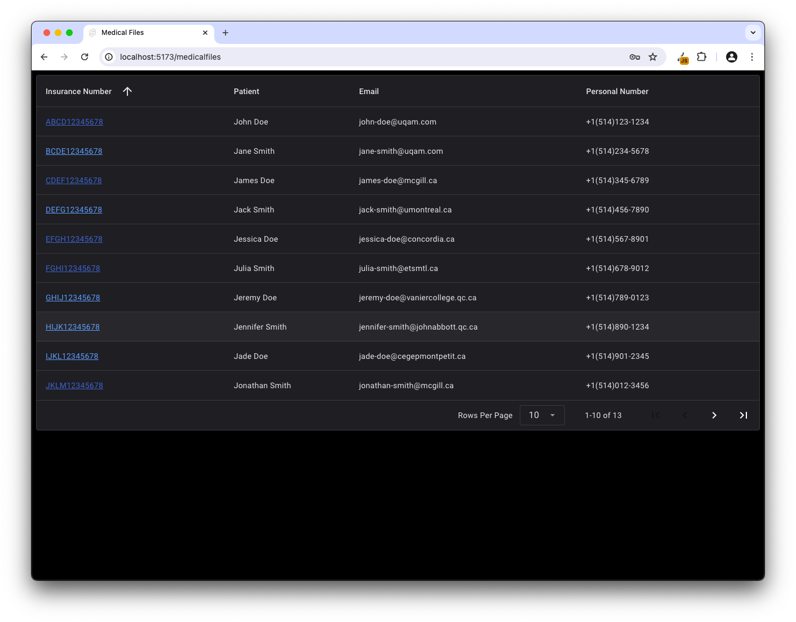
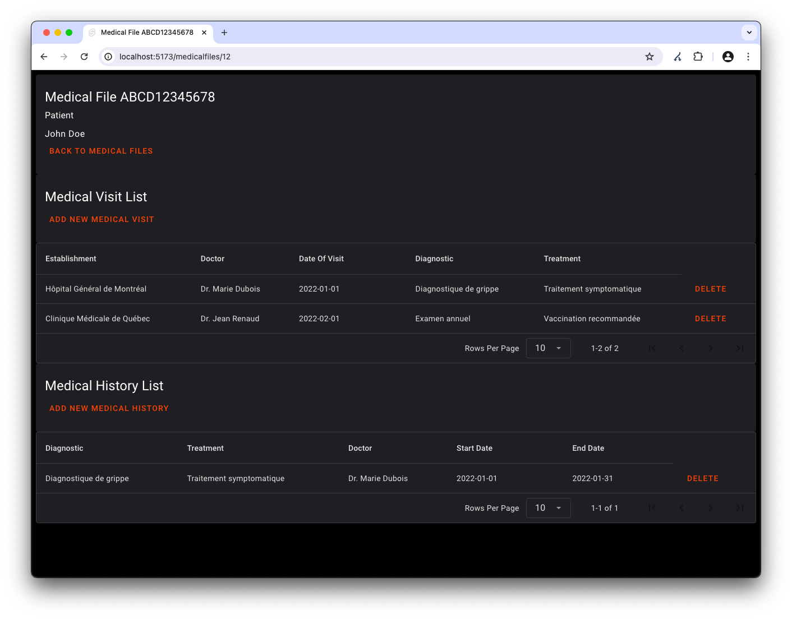

# SanteConnect

## To run the project

You have to run the backend and the frontend in two separate terminals.

Follow the instructions in the backend and frontend READMEs.

[backend README](backend/README.md)

[frontend README](frontend/README.md)

Once you have both running, you can access the web app at [http://localhost:5173](http://localhost:5173).

To log in, you can use the following credentials: (already in the database)

- username: `user`
- password: `user`

Once logged in, you can navigate through the website, click on any Inusrance Number in order to access the medical file.

On the medical file page, you can add a new medical visit or a new medical history, or you can delete them.

