# SantéConnect

## Table of Contents

1. [Architectural Design](#architectural-design)
2. [Use Case Diagrams](#use-case-diagrams)
3. [Class Diagrams](#class-diagrams)
4. [Sequence Diagrams](#sequence-diagrams)
5. [Package Diagrams](#package-diagrams)
6. [Component Diagram](#component-diagram)
7. [Deployment Diagram](#deployment-diagram)
8. [GRASP Patterns Justification](#grasp-patterns-justification)

## Note

The PlantUml code is located in the `plantUml` directory. Locating the code in a separate directory allows for better organization and easier access to the diagrams.

The architecure diagram image is located in the `misc/images` directory. plantUml was not used for this diagram, as it does not support the creation of such diagrams.

## Introduction

SantéConnect is a medical file management system containing a web and mobile protal for patients, an installed applicaton for doctors and healthcare professional and an API portal for RAMQ.

The application is designed to provide a centralized medical file for patients in Quebec.

Medical Files are created by the RAMQ, and are accessible by the patient and the doctor.
The RAMQ send a request to the system to create a medical file for a patient that has been registered in the RAMQ system.
Doctors can add medical visists, medical treatments, and modify any necessary information in the medical file.
Patients can view their medical file, and update their coordinates when necessary.
The RAMQ can also look through the modifications made by the doctor and the patient, and reconstruct the medical file if necessary.

## Architectural Design
<!-- (Insert architectural design diagram here and explain the different components of the system and their interactions) -->
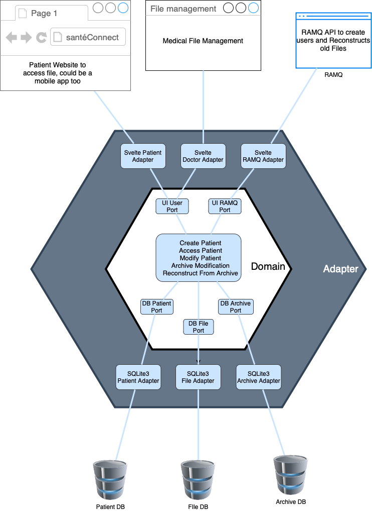

The hexagonal architecture divides the whole program into four spaces:

1. External systems, including web browsers, databases, and other computing services
2. Adapters implement the specific APIs required by the external systems, for example, a Svelte adapter for the web browser, and a SQLite3 adapter for the database
3. Ports are the abstraction of what our application needs from the external system
4. The domain model contains our application logic, free of external system details, the logic is a translation of the use cases into code

## Use Case Diagrams
<!-- (Insert use case diagrams here and explain the functionalities of the system) -->
<!-- ADD PUML -->
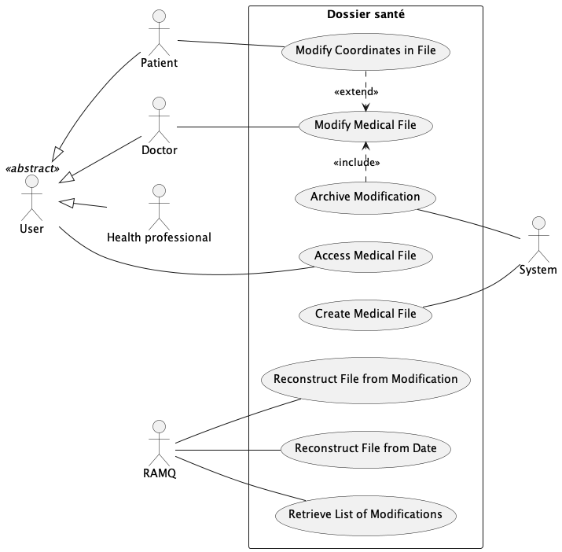

## Class Diagrams
<!-- (Insert class diagrams here and explain the domain concepts) -->
This class diagram represents only the domain model of the application. It does not include the classes that are used to interact with the external systems, such as the database, the web browser, and the RAMQ API.

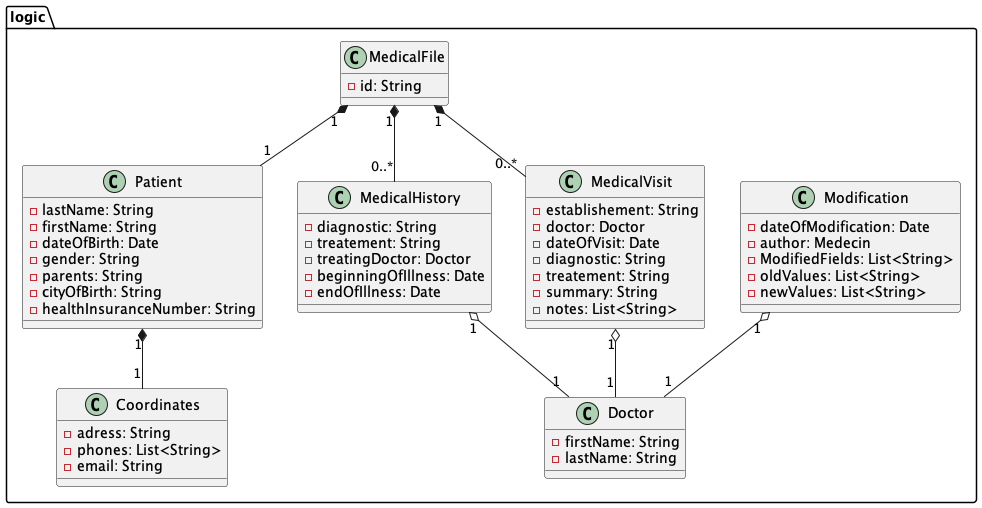

## Sequence Diagrams
<!-- (Insert sequence diagrams here and show the interactions between the classes for each use case) -->

TODO: Add sequence diagrams for each use case

createMedicalFile
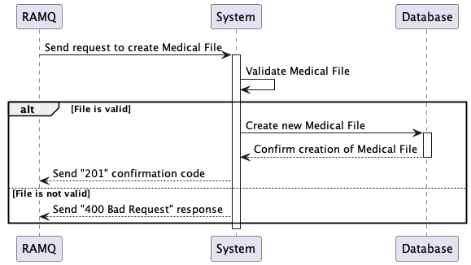

accessMedicalFile
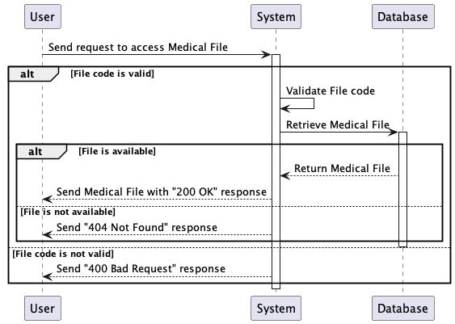

modifyCoordinates
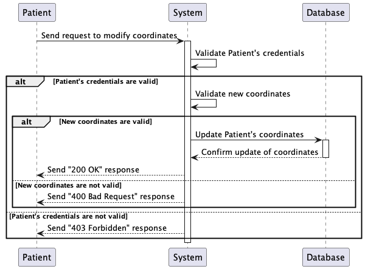

modifyMedicalFile and archiveModification
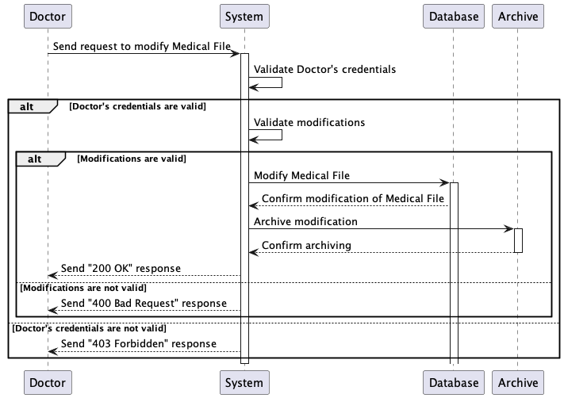

HTTP Codes are not included in the reconstruction sequence diagrams

reconstructMedicalFileFromModification
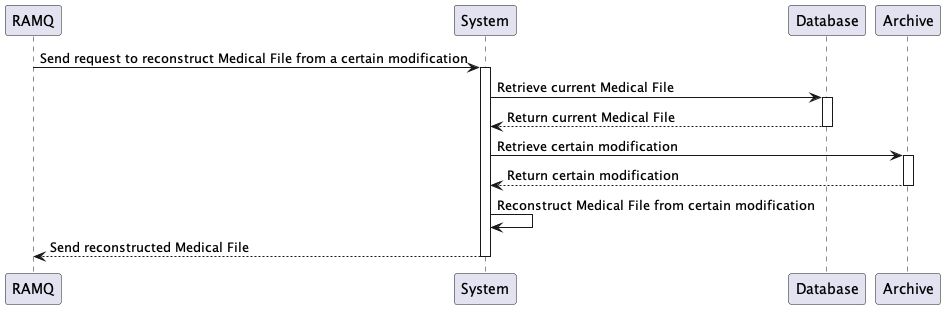

reconstructMedicalFileFromDate
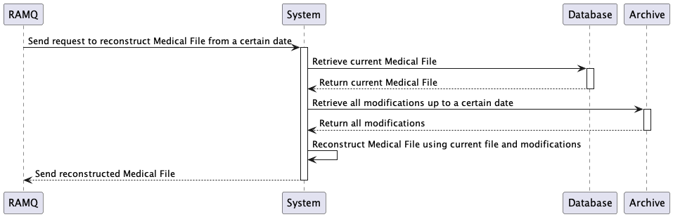

getModifications
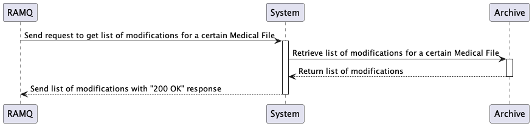

## Package Diagrams
<!-- (Insert package diagrams here and indicate the classes contained in the packages) -->

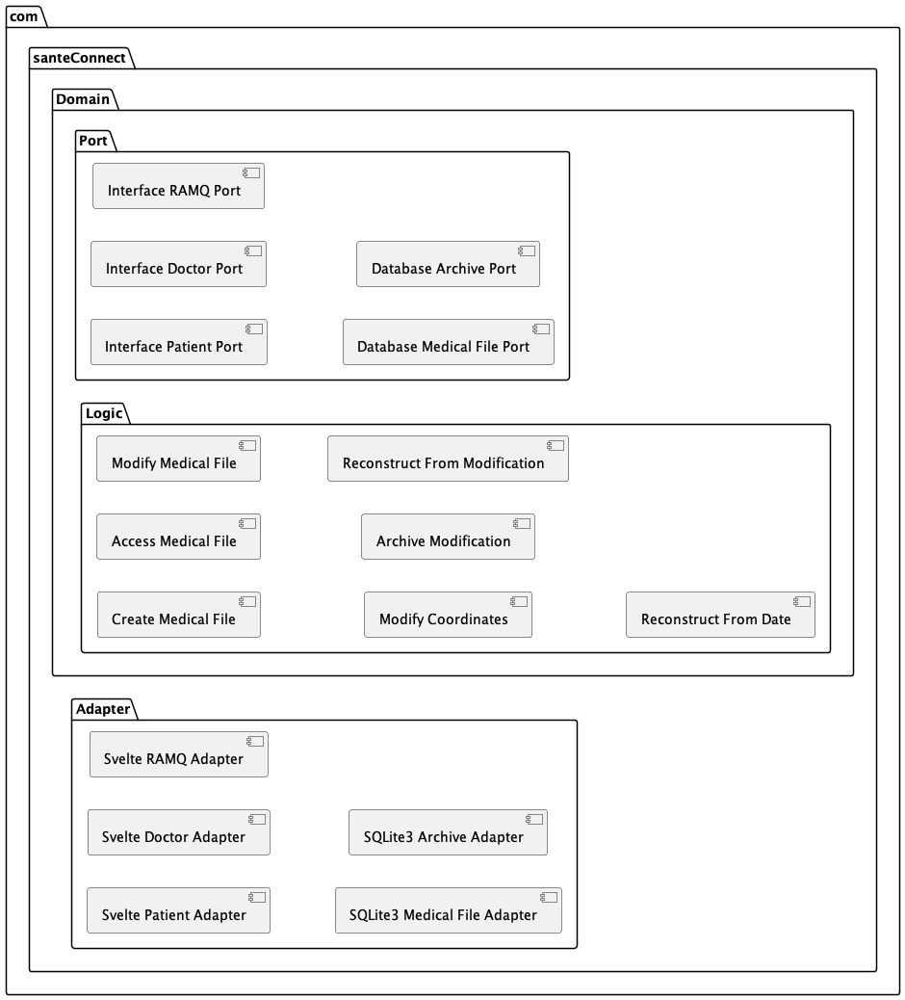

## Component Diagram
<!-- (Insert component diagram here) -->
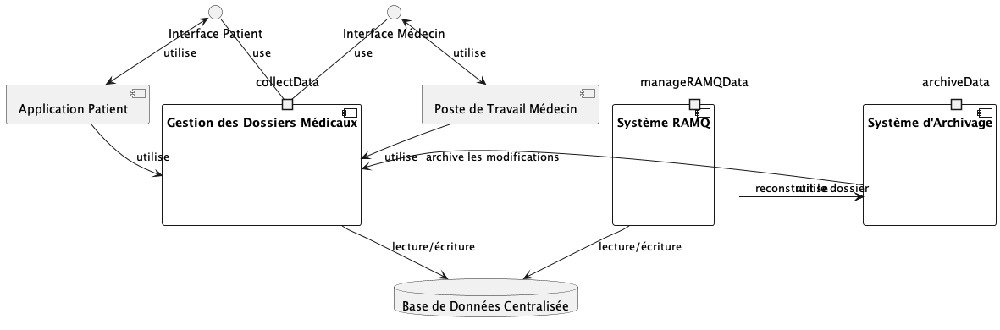

## Deployment Diagram
A ameliorer
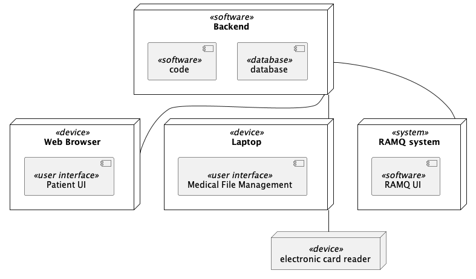

## GRASP Patterns Justification
<!-- (Justify each responsibility of the classes by a GRASP pattern. Document a justification for each public method and a justification for the creation of instances of a class) -->
Patron GRASP | Justification
--- | ---
Faible couplage | Grâce à l'architecture hexagonale, l'implémentaiton de l'application est indépendante des détails de l'interface utilisateur, de la base de données et des autres services externes. Cela permet de changer les détails de l'implémentation sans affecter le reste du système. Cela permet également de tester les composants de l'application indépendamment des services externes.
Contrôleur | Le contrôleur est responsable de la gestion des requêtes HTTP et de la logique métier. Ici, c'est les ports reliés aux intercafes utilisateurs qui sont responsables de la gestion des requêtes HTTP. Les ports sont des interfaces qui définissent les opérations que le contrôleur doit implémenter. Cela permet de séparer la logique métier de la logique de présentation.
Forte Cohésion | Les classes sont conçues pour avoir une seule responsabilité. Par exemple, la classe `Patient` est responsable de la gestion des informations du patient, et la classe `MedicalFile` est responsable de la gestion des informations du dossier médical. Cela permet de faciliter la maintenance et l'évolution du système.
Indirection | Les classes de l'application ne dépendent pas des détails de l'implémentation des services externes. Par exemple, la classe `Patient` ne dépend pas de la manière dont les informations du patient sont stockées dans la base de données. Cela permet de changer les détails de l'implémentation sans affecter le reste du système.
Protégé de variations | Les composants de l'application sont protégés des variations dans les services externes. Par exemple, si le système de gestion de base de données est changé, les classes de l'application n'ont pas besoin d'être modifiées. Cela permet de faciliter la maintenance et l'évolution du système.
