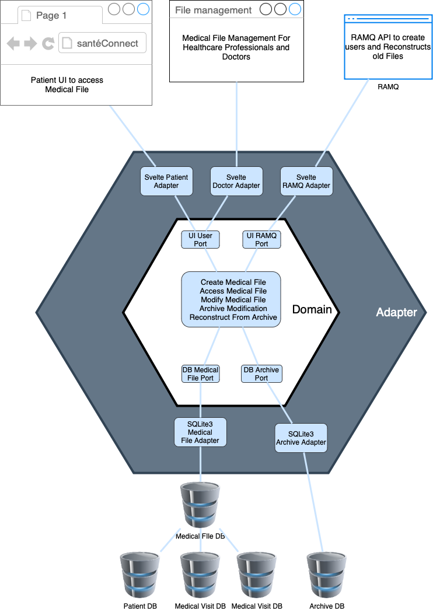
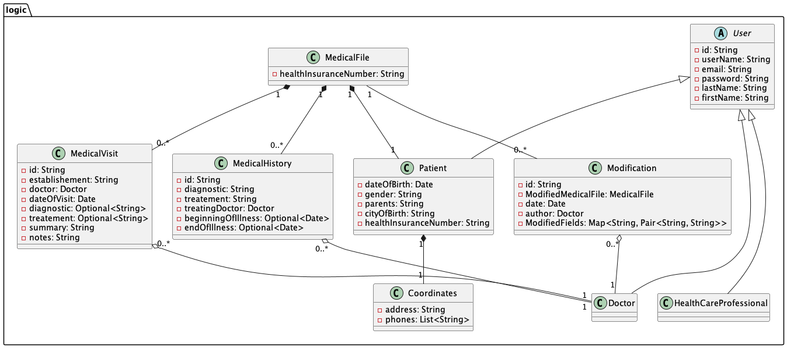
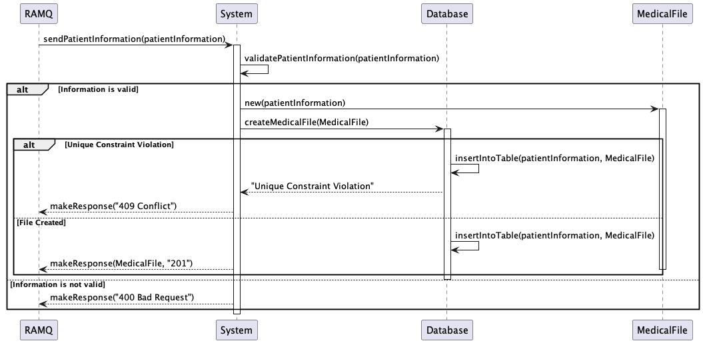

# SantéConnect

## Présentation

SantéConnect est un système de gestion de dossiers médicaux comprenant un portail web et mobile pour les patients, une application installée pour les médecins et les professionnels de la santé et un portail API pour la RAMQ.
L'application est conçue pour fournir un dossier médical centralisé aux patients du Québec.
Les dossiers médicaux sont créés par la RAMQ, et sont accessibles par le patient et le médecin.
La RAMQ envoie une demande au système pour créer un dossier médical pour un patient qui a été enregistré dans le système de la RAMQ.
Les médecins peuvent ajouter des visites médicales, des traitements médicaux et modifier toute information nécessaire dans le dossier médical.
Les patients peuvent consulter leur dossier médical et mettre à jour leurs coordonnées si nécessaire.
La RAMQ peut également consulter les modifications apportées par le médecin et le patient, et reconstituer le dossier médical si nécessaire.

## Table of Contents

1. [Conception Architecturale](#conception-architecturale)
2. [Diagrammes de Cas d'Utilisation](#diagrammes-de-cas-dutilisation)
3. [Diagrammes de Classes](#diagrammes-de-classes)
4. [Diagrammes de Sequence](#diagrammes-de-sequence)
5. [Diagrammes de Paquetage](#diagrammes-de-paquetage)
6. [Diagramme de Composants](#diagramme-de-composants)
7. [Diagramme de Deploiement](#diagramme-de-deploiement)
8. [Justification des Modeles GRASP](#justification-des-modeles-grasp)

## Conception Architecturale

L'architecture hexagonale divise l'ensemble du programme en quatre espaces :

1. Les systèmes externes, y compris les navigateurs web, les bases de données et les autres services informatiques.
2. Les adaptateurs mettent en œuvre les API spécifiques requises par les systèmes externes, par exemple, un adaptateur Svelte pour le navigateur web et un adaptateur SQLite3 pour la base de données.
3. Les ports sont l'abstraction de ce dont notre application a besoin de la part du système externe.
4. Le modèle de domaine contient la logique de notre application, sans les détails du système externe, la logique est une traduction des cas d'utilisation en code.

L'architecture hexagonale est basée sur le principe de l'inversion de la dépendance, qui stipule que les modules de haut niveau ne doivent pas dépendre des modules de bas niveau, mais doivent dépendre des abstractions. Ce principe garantit que le modèle du domaine est indépendant des systèmes externes et que les systèmes externes sont indépendants du modèle du domaine.
Cette architecture permet également de tester le modèle du domaine indépendamment des systèmes externes et de tester les systèmes externes indépendamment du modèle du domaine.

## Diagrammes de Cas d'Utilisation

- **Access Medical File** : Ce cas d'utilisation décrit le scénario où un utilisateur (qui peut être un patient, un médecin ou un professionnel de la santé) accède à un dossier médical.

- **Modify Medical File** : Ce cas d'utilisation décrit le scénario où un médecin modifie un dossier médical. Il peut être étendu par le cas d'utilisation "Modify Coordinates in File" et inclut le cas d'utilisation "Archive Modification".

- **Modify Coordinates in File** : Ce cas d'utilisation décrit le scénario où un patient modifie ses coordonnées dans son dossier médical. Il étend le cas d'utilisation "Modify Medical File".

- **Archive Modification** : Ce cas d'utilisation est inclus dans le cas d'utilisation "Modify Medical File" et décrit le scénario où une modification est archivée lors de la modification d'un dossier médical.

- **Retrieve List of Modifications** : Ce cas d'utilisation décrit le scénario où le système RAMQ récupère une liste de modifications. Il peut étendre le cas d'utilisation "Reconstruct File from Modification".

- **Reconstruct File from Modification** : Ce cas d'utilisation décrit le scénario où le système RAMQ reconstruit un dossier médical à partir d'une liste de modifications. Il est étendu par le cas d'utilisation "Retrieve List of Modifications".

- **Reconstruct File from Date** : Ce cas d'utilisation décrit le scénario où le système RAMQ reconstruit un dossier médical à partir d'une date spécifique.

- **Create Medical File** : Ce cas d'utilisation décrit le scénario où le système RAMQ crée un nouveau dossier médical.

## Diagramme de Classes

- **User** : Classe abstraite qui représente un utilisateur avec des attributs tels que l'ID, le nom d'utilisateur, l'email, le mot de passe, le nom et le prénom.

- **Patient** : Classe qui hérite de `User` et ajoute des attributs spécifiques au patient tels que la date de naissance, le sexe, les parents, la ville de naissance et le numéro d'assurance maladie.

- **Doctor** et **HealthCareProfessional** : Classes qui héritent de `User`, représentant respectivement un médecin et un professionnel de la santé.

- **Coordinates** : Classe qui représente les coordonnées d'un patient, avec des attributs pour l'adresse et les numéros de téléphone.

- **MedicalFile** : Classe centrale du diagramme. Elle représente le dossier médical d'un patient, lié à un patient, plusieurs visites médicales, plusieurs historiques médicaux et plusieurs modifications. Son attribut principal est le numéro d'assurance maladie.

- **MedicalHistory** et **MedicalVisit** : Classes qui représentent respectivement l'historique médical et les visites médicales d'un patient. Elles sont liées à la classe `Doctor` et à la classe `MedicalFile`.

- **Modification** : Classe qui représente une modification apportée à un dossier médical. Elle est liée à la classe `Doctor` et à la classe `MedicalFile`.

Ce diagramme de classes représente uniquement le modèle de domaine de l'application. Il n'inclut pas les classes utilisées pour interagir avec les systèmes externes, tels que la base de données, le navigateur web et l'API de la RAMQ.

## Diagrammes de Sequence

createMedicalFile

accessMedicalFile

modifyCoordinates

modifyMedicalFile and archiveModification

getModifications

reconstructMedicalFileFromModification

reconstructMedicalFileFromDate

## Diagramme de Paquetage

Le diagramme de paquetage UML illustre l'organisation des paquets dans le système de gestion de dossiers médicaux. Voici une explication des différents paquets :

- **com.santeConnect.Adapter** : Ce paquet contient les adaptateurs pour les différents composants du système, y compris les adaptateurs pour l'interface utilisateur du patient, du médecin et du système RAMQ, ainsi que les adaptateurs pour la base de données des dossiers médicaux et des archives.

- **com.santeConnect.Domain.Logic** : Ce paquet contient la logique métier du système, y compris la création, l'accès et la modification des dossiers médicaux, la modification des coordonnées, l'archivage des modifications, et la reconstruction des dossiers médicaux à partir des modifications ou d'une date spécifique.

- **com.santeConnect.Domain.Port** : Ce paquet contient les ports d'interface pour les différents composants du système, y compris les ports pour l'interface utilisateur du patient, du médecin et du système RAMQ, ainsi que les ports pour la base de données des dossiers médicaux et des archives.

## Diagramme de Composants

Le diagramme de composants illustre un système informatique médical où une base de données centrale est interfacée par des modules distincts pour les patients, les médecins, et la RAMQ, garantissant une gestion cohérente et sécurisée des dossiers médicaux. Les interactions sont régulées par un service d'authentification, assurant que seuls les utilisateurs autorisés peuvent accéder ou modifier les données médicales. L'architecture facilite une vision complète et actualisée de l'état de santé du patient, améliorant ainsi la qualité des soins.

## Diagramme de Déploiement

Le diagramme de déploiement UML illustre l'architecture du système de gestion de dossiers médicaux. Voici une explication des différents éléments :

- **Web Browser** : C'est le navigateur Web utilisé par les patients pour accéder à l'application de gestion de dossiers médicaux (Medical File Management).
- **Laptop** : C'est un autre dispositif fournit aux médecins et aux professionnels de la santé pour accéder à l'application de gestion de dossiers médicaux. Il peut être tout autre dispositif électronique.
- **Electronic Card Reader** : C'est un dispositif utilisé pour lire les cartes électroniques. Il est connecté au laptop des médecins et des professionnels de la santé.
- **RAMQ System** : C'est un système fournit au RAMQ pour envoyer les demandes de création de dossiers médicaux et pour consulter les modifications apportées par les médecins et les patients.
- **Backend** : C'est le logiciel qui gère la logique de l'application. Il comprend le code de l'application et une base de données. Le backend est connecté au navigateur Web, au laptop, au système RAMQ, ainsi qu'à la base de données.

## Justification des Modeles GRASP

Patron GRASP | Justification
--- | ---
#1 Spécialiste de l'Infomation | La classe `MedicalFile` est responsable de la gestion des informations du dossier médical. Cela permet de centraliser la logique métier liée au dossier médical dans une seule classe. Elle est aussi la classe qui contient pour un Patient,et une liste MedicalVisit et MedicalTreatment. On utilise la méthode `accessMedicalFile` pour accéder au dossier médical d'un patient.
#2 Créateur | La classe `MedicalFile` est responsable de la création des visites médicales et des traitements médicaux. Cela permet de centraliser la logique de création dans une seule classe. On utilise la méthode `createMedicalFile` pour créer un dossier médical pour un patient.
#3 Faible couplage | Grâce à l'architecture hexagonale, l'implémentaiton de l'application est indépendante des détails de l'interface utilisateur, de la base de données et des autres services externes. Cela permet de changer les détails de l'implémentation sans affecter le reste du système. Cela permet également de tester les composants de l'application indépendamment des services externes.
#4 Contrôleur | Le contrôleur est responsable de la gestion des requêtes HTTP et de la logique métier. Ici, c'est les ports reliés aux intercafes utilisateurs qui sont responsables de la gestion des requêtes HTTP. Les ports sont des interfaces qui définissent les opérations que le contrôleur doit implémenter. Cela permet de séparer la logique métier de la logique de présentation.
#5 Forte Cohésion | Les classes sont conçues pour avoir une seule responsabilité. Par exemple, la classe `Patient` est responsable de la gestion des informations du patient, et la classe `MedicalFile` est responsable de la gestion des informations du dossier médical. Cela permet de faciliter la maintenance et l'évolution du système.
#8 Indirection | Les classes de l'application ne dépendent pas des détails de l'implémentation des services externes. Par exemple, la classe `Patient` ne dépend pas de la manière dont les informations du patient sont stockées dans la base de données. Cela permet de changer les détails de l'implémentation sans affecter le reste du système.
#9 Protégé de variations | Les composants de l'application sont protégés des variations dans les services externes. Par exemple, si le système de gestion de base de données est changé, les classes de l'application n'ont pas besoin d'être modifiées. Cela permet de faciliter la maintenance et l'évolution du système.

## Note

Le code PlantUml est situé dans le répertoire `plantUml`. Le fait de placer le code dans un répertoire séparé permet une meilleure organisation et un accès plus facile aux diagrammes.
L'image du diagramme architecure est située dans le répertoire `misc/images`. plantUml n'a pas été utilisé pour ce diagramme, car il ne permet pas la création de tels diagrammes.
