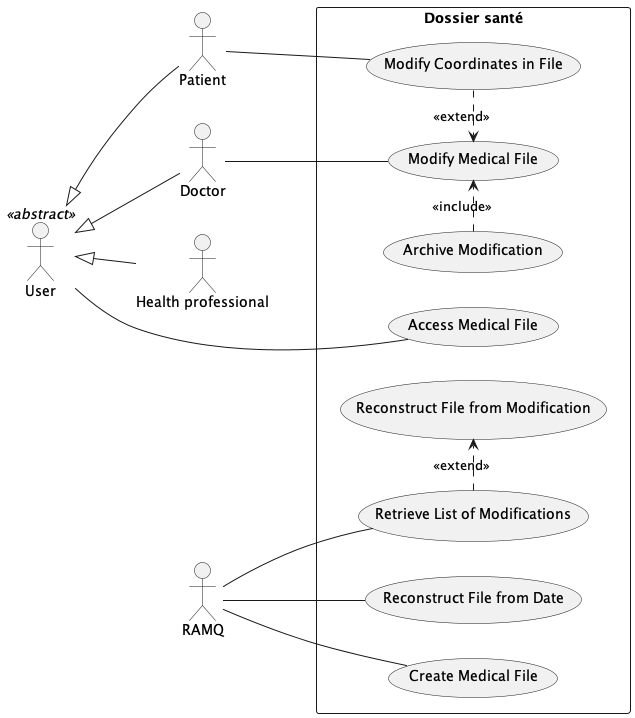
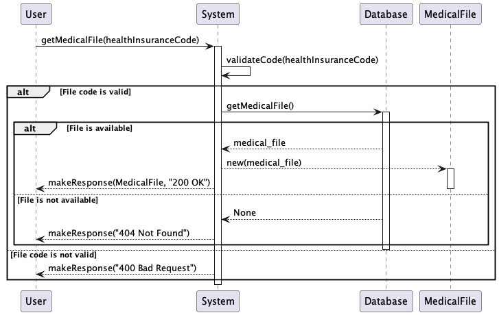
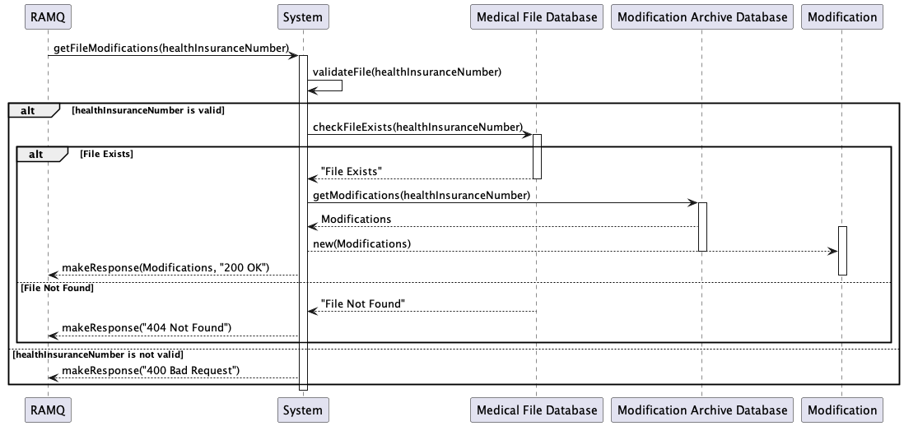
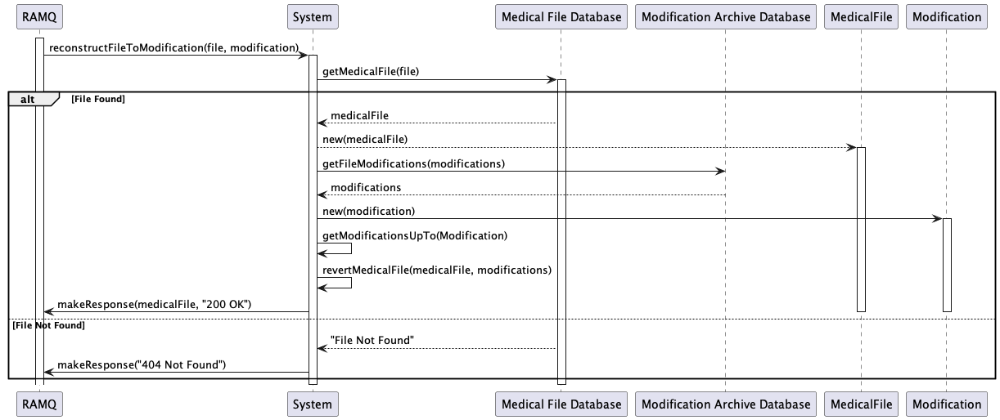
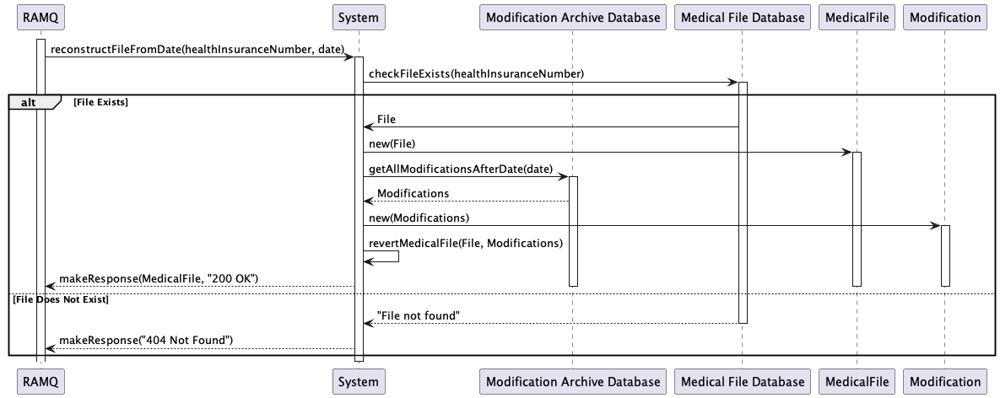

# SantéConnect

## Présentation

SantéConnect est un système de gestion de dossiers médicaux comprenant un portail web et mobile pour les patients, une application installée pour les médecins et les professionnels de la santé et un portail API pour la RAMQ.
L'application est conçue pour fournir un dossier médical centralisé aux patients du Québec.
Les dossiers médicaux sont créés par la RAMQ, et sont accessibles par le patient et le médecin.
La RAMQ envoie une demande au système pour créer un dossier médical pour un patient qui a été enregistré dans le système de la RAMQ.
Les médecins peuvent ajouter des visites médicales, des traitements médicaux et modifier toute information nécessaire dans le dossier médical.
Les patients peuvent consulter leur dossier médical et mettre à jour leurs coordonnées si nécessaire.
La RAMQ peut également consulter les modifications apportées par le médecin et le patient, et reconstituer le dossier médical si nécessaire.

## Table of Contents

1. [Conception Architecturale](#conception-architecturale)
2. [Diagrammes de Cas d'Utilisation](#diagrammes-de-cas-dutilisation)
3. [Diagrammes de Classes](#diagrammes-de-classes)
4. [Diagrammes de Sequence](#diagrammes-de-sequence)
5. [Diagrammes de Paquetage](#diagrammes-de-paquetage)
6. [Diagramme de Composants](#diagramme-de-composants)
7. [Diagramme de Deploiement](#diagramme-de-deploiement)
8. [Justification des Modeles GRASP](#justification-des-modeles-grasp)

## Conception Architecturale

L'architecture hexagonale divise l'ensemble du programme en quatre espaces :

1. Les systèmes externes, y compris les navigateurs web, les bases de données et les autres services informatiques.
2. Les adaptateurs mettent en œuvre les API spécifiques requises par les systèmes externes, par exemple, un adaptateur Svelte pour le navigateur web et un adaptateur SQLite3 pour la base de données.
3. Les ports sont l'abstraction de ce dont notre application a besoin de la part du système externe.
4. Le modèle de domaine contient la logique de notre application, sans les détails du système externe, la logique est une traduction des cas d'utilisation en code.

L'architecture hexagonale est basée sur le principe de l'inversion de la dépendance, qui stipule que les modules de haut niveau ne doivent pas dépendre des modules de bas niveau, mais doivent dépendre des abstractions. Ce principe garantit que le modèle du domaine est indépendant des systèmes externes et que les systèmes externes sont indépendants du modèle du domaine.
Cette architecture permet également de tester le modèle du domaine indépendamment des systèmes externes et de tester les systèmes externes indépendamment du modèle du domaine.

## Diagrammes de Cas d'Utilisation

## Diagrammes de Classes

Ce diagramme de classes représente uniquement le modèle de domaine de l'application. Il n'inclut pas les classes utilisées pour interagir avec les systèmes externes, tels que la base de données, le navigateur web et l'API de la RAMQ.

## Diagrammes de Sequence

CreateMedicalFile

Ici, la RAMQ communique avec le systeme afin d'ajouter un dossier medical d'un utilisateur venant de s'inscrire a la RAMQ. 
La RAMQ envoie donc les informations de l'utilisateur au system qui va s'occuper de valider ses informatinos puis de creer un nouvel utilisateur et l'ajouter a la base de données

AccessMedicalFile

Ici, l'utilisateur veut acceder a un dossier medical. Il envoie donc une requete au system qui va verifier si le dossier medicale est present. Selon si tout est valide, l'utilisateur recoit le fichier correctement ou alors il recoit un message d'erreur

ModifyCoordinates

Lorsqu'un patient souhaite modifier ses coordonnées, il lance une requete au system qui va valider la connexion du patient ainsi que ces coordonnes puis va ensoite retourner les informations du patient modifier ou alors un message d'erreur si la requete n'est pas valide

ModifyMedicalFile and archiveModification

Ici, le docteur souhaite modifier le dossier medical d'un patient. Le system verifie que les informations du docteurs sont valides et que les changements sont valides puis si c'est correct, le fichier medical est modifier et les modifications faites sont archivees. 
Dans le cas ou se serait invalide, le system retourne un message d'erreur a l'utilisateur

GetModifications
Ici, la ramq souhaite recuperer certains modifications associees a un dossier. Le system va verifier que le dossier existe puis envoyer les modifications a la ramq. Dans le cas ou le fichier n'existe pas ou le numero d'assurance social est invalide, il lui retourne un message d'erreur.

ReconstructMedicalFileFromModification
La RAMQ a la possibilite de reconstruire un fichier a partir d'une modifications passee. Ici, le system recupere le fichier medical ainsi que les modifications faite depuis la modification choisie par la RAMQ. Ensuite le system revert les changements effectues depuis cette date et retourne le nouveau dossier modifier.

reconstructMedicalFileFromDate
La RAMQ a aussi la possibilite de reconstruire un fichier a partir d'une date. Ici, le system recupere le fichier medical ainsi que les modifications faite depuis cette date. Ensuite le system revert les changements effectues depuis cette date et retourne le nouveau dossier modifier.

## Diagrammes de Paquetage

## Diagramme de Composants

Le diagramme de composants illustre un système informatique médical où une base de données centrale est interfacée par des modules distincts pour les patients, les médecins, et la RAMQ, garantissant une gestion cohérente et sécurisée des dossiers médicaux. Les interactions sont régulées par un service d'authentification, assurant que seuls les utilisateurs autorisés peuvent accéder ou modifier les données médicales. L'architecture facilite une vision complète et actualisée de l'état de santé du patient, améliorant ainsi la qualité des soins.

## Diagramme de Deploiement

A ameliorer

## Justification des Modeles GRASP

Patron GRASP | Justification
--- | ---
Faible couplage | Grâce à l'architecture hexagonale, l'implémentaiton de l'application est indépendante des détails de l'interface utilisateur, de la base de données et des autres services externes. Cela permet de changer les détails de l'implémentation sans affecter le reste du système. Cela permet également de tester les composants de l'application indépendamment des services externes.
Contrôleur | Le contrôleur est responsable de la gestion des requêtes HTTP et de la logique métier. Ici, c'est les ports reliés aux intercafes utilisateurs qui sont responsables de la gestion des requêtes HTTP. Les ports sont des interfaces qui définissent les opérations que le contrôleur doit implémenter. Cela permet de séparer la logique métier de la logique de présentation.
Forte Cohésion | Les classes sont conçues pour avoir une seule responsabilité. Par exemple, la classe `Patient` est responsable de la gestion des informations du patient, et la classe `MedicalFile` est responsable de la gestion des informations du dossier médical. Cela permet de faciliter la maintenance et l'évolution du système.
Indirection | Les classes de l'application ne dépendent pas des détails de l'implémentation des services externes. Par exemple, la classe `Patient` ne dépend pas de la manière dont les informations du patient sont stockées dans la base de données. Cela permet de changer les détails de l'implémentation sans affecter le reste du système.
Protégé de variations | Les composants de l'application sont protégés des variations dans les services externes. Par exemple, si le système de gestion de base de données est changé, les classes de l'application n'ont pas besoin d'être modifiées. Cela permet de faciliter la maintenance et l'évolution du système.

## Note

Le code PlantUml est situé dans le répertoire `plantUml`. Le fait de placer le code dans un répertoire séparé permet une meilleure organisation et un accès plus facile aux diagrammes.
L'image du diagramme architecure est située dans le répertoire `misc/images`. plantUml n'a pas été utilisé pour ce diagramme, car il ne permet pas la création de tels diagrammes.

