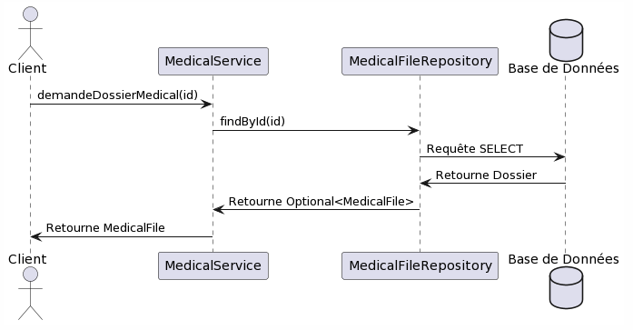

# Partie 2: Introduction des Patrons de Conception

## Équipe 9

- Dominique Elias ELID14019800
- Emil Surkhaev SURE89080008
- Youenn Pierre-Justin PIEY78070308
- Keven Jude Anténor ANTK08129003

### Informations du cours

- **Cours :** INF5153 groupe 30
- **Titre :** Génie logiciel: conception
- **Professeur :** Gnagnely Serge Dogny
- **Date :** 8 Avril 2024

## Table of Contents

1. [Composite](#composite)
2. [Nom du Patron de Conception 2](#nom-du-patron-de-conception-2)
3. [Nom du Patron de Conception 3](#nom-du-patron-de-conception-3)
4. [Nom du Patron de Conception 4](#nom-du-patron-de-conception-4)
5. [Différences entre l'implémentation et la conception](#différences-entre-limplémentation-et-la-conception)
6. [Problèmes de Conception et Corrections](#problèmes-de-conception-et-corrections)

## Composite 
Par Dominique Elias

- Construit un objet selon une structure arborescente
- Permet de traiter uniformément un objet ou un ensemble d’objets.

### Diagramme de Classe

Plant uml code inside plantUml-partie2 directory

### Diagramme de Séquence

### Implémentation

[Description de l'implémentation du patron de conception]

### Problèmes de Conception et Corrections

[Description de la manière dont les problèmes de conception ont été détectés et corrigés]

## Nom du Patron de Conception 2
Par Emil Surkhaev

Plant uml code inside plantUml-partie2 directory
### Diagramme de Classe

Le diagramme de classe montre des interfaces pour chaque 'repository' (par exemple, PatientRepository, MedicalFileRepository, MedicalVisitRepository, CoordinateRepository)
avec des méthodes pour les opérations courantes telles que findById(), findAll(), save() et delete(). Chacune de ces interfaces serait implémentée par une classe qui gère
les interactions avec la base de données pour cette entité.

### Diagramme de Séquence

Le diagramme de séquence illustre un scénario typique où un client interagit avec un 'repository' pour récupérer ou persister des données.
Il pourrait montrer un MedicalService demandant à un MedicalFileRepository un dossier médical par ID
qui à son tour interagit avec la base de données.

### Implémentation

L'implémentation du patron Repository consiste à encapsuler la logique nécessaire pour accéder aux sources de données pour les objets de domaine, fournissant une séparation
claire entre la logique de l'application et la logique d'accès aux données. Les implémentations utiliseraient les méthodes de dépôt CRUD (Create, Read, Update, Delete) fournies
par Spring Data, qui étend déjà Repository pour les opérations CRUD de base.
Chaque interface de dépôt aurait des méthodes adaptées aux besoins, telles que la recherche d'un patient 
par nom ou d'un dossier médical par numéro d'assurance. Les implémentations s'occuperaient de la création de méthodes de requête,
en utilisant la création de requête de Spring Data à partir des noms de méthodes.

## Nom du Patron de Conception 3
Par Youenn Pierre-Justin

### Diagramme de Classe

Plant uml code inside plantUml-partie2 directory
[Insérer le diagramme de classe ici]

### Diagramme de Séquence

Plant uml code inside plantUml-partie2 directory
[Insérer le diagramme de séquence ici]

### Implémentation

[Description de l'implémentation du patron de conception]

## Nom du Patron de Conception 4
Par Keven Jude Anténor

### Diagramme de Classe

Plant uml code inside plantUml-partie2 directory
[Insérer le diagramme de classe ici]

### Diagramme de Séquence

Plant uml code inside plantUml-partie2 directory
[Insérer le diagramme de séquence ici]

### Implémentation

[Description de l'implémentation du patron de conception]

Pour chaque problème de conception que vous allez corriger, vous devrez décrire comment vous avez détecté le problème de conception et comment vous l'avez corrigé.

### Différences entre l'implémentation et la conception

Toute différence entre l'implémentation et la conception doit être documentée dans le rapport que vous allez me remettre.

### Problèmes de Conception et Corrections

Pour chaque problème de conception que vous allez corriger, vous devrez décrire comment vous avez détecté le problème de conception et comment vous l'avez corrigé.
