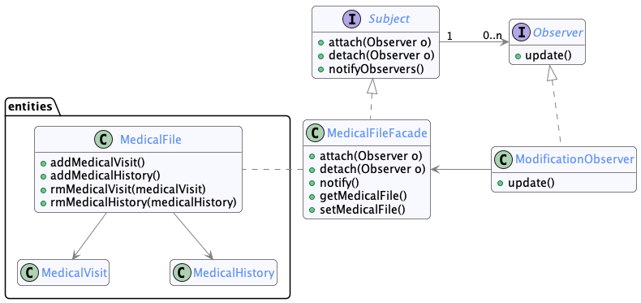
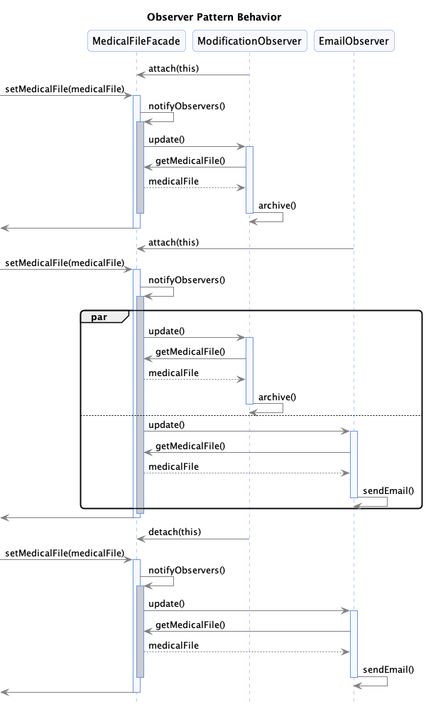

# Partie 2: Introduction des Patrons de Conception

## Équipe 9

- Dominique Elias ELID14019800
- Emil Surkhaev SURE89080008
- Youenn Pierre-Justin PIEY78070308
- Keven Jude Anténor ANTK08129003

### Informations du cours

- **Cours :** INF5153 groupe 30
- **Titre :** Génie logiciel: conception
- **Professeur :** Gnagnely Serge Dogny
- **Date :** 8 Avril 2024

## Table of Contents

1. [Facade-Observer](#facade-observer)
2. [Nom du Patron de Conception 2](#nom-du-patron-de-conception-2)
3. [Nom du Patron de Conception 3](#nom-du-patron-de-conception-3)
4. [Nom du Patron de Conception 4](#nom-du-patron-de-conception-4)
5. [Différences entre l'implémentation et la conception](#différences-entre-limplémentation-et-la-conception)
6. [Problèmes de Conception et Corrections](#problèmes-de-conception-et-corrections)

## Facade-Observer

Par Dominique Elias

### Diagramme de Classe



### Diagramme de Séquence

Patron `Facade`, utiliser principalement pour découpler la classe `MedicalFile` de l'interface de l'`Observer`.


Patron `Observer`, on montre trois exécutions de la méthode setMedicalFile de la classe `MedicalFileFacade` qui notifie les `Observers`.
Avant la première exécution, l'`Observer` `ModificationObserver` est instancié et ajouté à la liste des `Observers` de `MedicalFileFacade`.
Ensuite, lors de l'exécution de la méthode `setMedicalFile`, l'`Observer` `ModificationObserver` est notifié et mis à jour automatiquement.
On instancie un autre `Observer` `EmailObserver` et il s'ajoute à la liste des `Observers` de `MedicalFileFacade`.
Quand on exécute la méthode `setMedicalFile` une deuxième fois, les deux `Observers` sont notifiés et mis à jour automatiquement.
L'`Observer` `ModificationObserver` décide de ne plus être notifié et il est retiré de la liste des Observers de `MedicalFileFacade` avec la méthode `detach()`.
Donc lors de la troisième exécution de la méthode `setMedicalFile`, seul l'`Observer` `EmailObserver` est notifié et mis à jour automatiquement.



### Implémentation

Le patron `Observer` est utilisé pour permettre à un objet de la classe `ModificationObserver` d'être notifié et mis à jour automatiquement lorsqu'un objet `medicalFileFacade` (Subject) dont il dépent change d'état.

Rappel (partie1) : La classe `Modification` sert à sauvgarder les modifications apportées à un `medicalFile` dans la base de données `Archive`.

Donc lorsqu'un objet `MedicalFile` change d'état, l'objet `ModificationObserver` est notifiée et mise à jour automatiquement à travers un objet `medicalFileFacade`, et les modifications sont sauvegardées dans la base de données.

Ce Patron offre aussi la flexibilité de pouvoir ajouter d'autres classes Observers qui dépendent de `medicalFileFacade` sans avoir à modifier la classe.

Par exemple, si on veut ajouter une classe qui envoie un courriel à un médecin lorsqu'un `medicalFile` est modifié, on peut le faire en ajoutant une classe `EmailObserver` qui réalise (implements) `Observer`, sans avoir à modifier `medicalFileFacade`.

On sert du patron `Facade` ici pour garder la classe `MedicalFile` indépendante de l'interface de l'`Observer`.

### Problèmes de Conception et Corrections

- **Problème de Conception :** D'abord, on a pas utilisé le patron `Facade` pour simplifier l'interface de sous-système `MedicalFile` et découpler de l'interface de l'`Observer`.
- **Correction :** Donc on a corrigé ce problème en ajoutant la classe `MedicalFileFacade` qui sert d'interface unifiée pour les classes `Observers`.

### Différences entre l'implémentation et la conception

- **Différence :** Dans `ModificationObserver`, la méthode `archive()` affiche un message à la console pour simuler l'archivage des modifications dans la base de données.
Cependant, on peut toujours l'implémenter lorsque l'interface de la RAMQ est disponible.
Pour vérifier que l'`Observer` est notifié et mis à jour automatiquement, on affiche un message à la console.
Voici une capture d'écran de la console après mettre à jour un medical file :


Note: Vous pouvez vérifier vous même en ajoutant ou supprimant des medical visit sur le site web(frontend).

C'est recommandé de commenter cette ligne dans `application.properties` pour ne pas afficher les requêtes SQL dans la console.

```properties
spring.jpa.show-sql=true
```

### Définitions des patrons de conception

- Intention de l'`Observer` : Définir une interdépendance de type un-à-plusieurs, de façon que quand un objet change d'état, tous ceux qui en dépendent en soient notifiés et automatiquement mis à  jour.
- Intention de la `Facade` : Fournit une interface unifiée, à l'ensemble des interfaces d'un sous-système. La façade fournit une interface de plus haut niveau, qui rend le sous-système plus facile à utiliser.

## Nom du Patron de Conception 2

Par Emil Surkhaev

### Diagramme de Classe


### Diagramme de Séquence


### Implémentation

Le patron `Singleton` est utilisé pour s'assurer qu'une seule instance du service `JwtService` est créée et utilisée dans toute l'application SantéConnect.
Cette instance unique gère la création et la validation des JWT tokens utilisés pour l'authentification des utilisateurs.
Le `Singleton` est particulièrement important pour le service de jetons JWT car il doit conserver une configuration cohérente et sécurisée pour la signature, la création et la vérification des jetons.
la classe `JwtService` est un singleton car spring boot crée une seule instance pour chaque classe annotée avec `@Component`.
On a ajouté `@scope("singleton")` pour s'assurer que spring boot crée une seule instance de `JwtService` pour toute l'application.
Notez que c'est la valeur par défaut de `@Component` mais on l'a ajouté pour plus de clarté.

### Problèmes de Conception et Corrections

- **Problème de Conception :** Sans le patron `Singleton`, plusieurs instances du `JwtService` pourraient être créées, introduisant le risque d'incohérence dans la gestion des jetons et potentiellement des failles de sécurité.
- **Correction :** En implémentant le `Singleton`, nous nous assurons que `JwtService` est instancié une seule fois, maintenant l'intégrité et la cohérence du processus d'authentification.

### Différences entre l'implémentation et la conception

- **Différence :** L'ancienne implementation de la classe `JwtService` utilisait l'implementation classique d'un `Singleton` pour créer une instance unique, avec un constructeur privé et une méthode statique pour obtenir l'instance unique. Ceci était moins flexible que l'implémentation actuelle avec `@Component`, qui est plus simple et plus conforme aux standards de Spring Boot.

### Définitions des patrons de conception

- Intention de l'`Singleton` : Assurer qu'une classe n'ait qu'une seule instance et fournir un point d'accès global à cette instance.

## Nom du Patron de Conception 3
Par Youenn Pierre-Justin

### Diagramme de Classe

Plant uml code inside plantUml-partie2 directory
[Insérer le diagramme de classe ici]

### Diagramme de Séquence

Plant uml code inside plantUml-partie2 directory
[Insérer le diagramme de séquence ici]

### Implémentation

[Description de l'implémentation du patron de conception]


## Nom du Patron de Conception 4
Par Keven Jude Anténor

### Diagramme de Classe

Plant uml code inside plantUml-partie2 directory
[Insérer le diagramme de classe ici]

### Diagramme de Séquence

Plant uml code inside plantUml-partie2 directory
[Insérer le diagramme de séquence ici]

### Implémentation

[Description de l'implémentation du patron de conception]

Pour chaque problème de conception que vous allez corriger, vous devrez décrire comment vous avez détecté le problème de conception et comment vous l'avez corrigé.

### Différences entre l'implémentation et la conception

Toute différence entre l'implémentation et la conception doit être documentée dans le rapport que vous allez me remettre.

### Problèmes de Conception et Corrections

Pour chaque problème de conception que vous allez corriger, vous devrez décrire comment vous avez détecté le problème de conception et comment vous l'avez corrigé.
