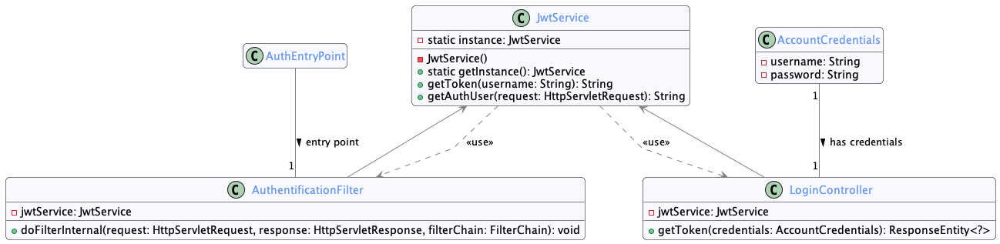
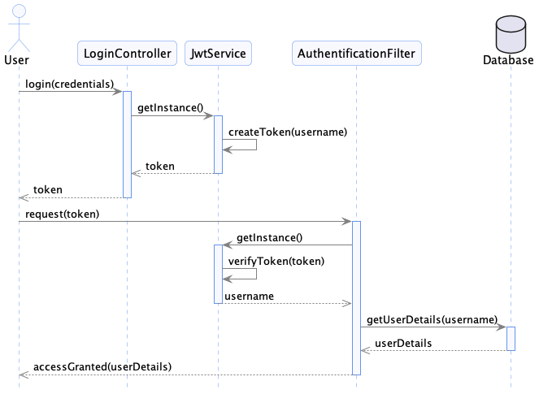
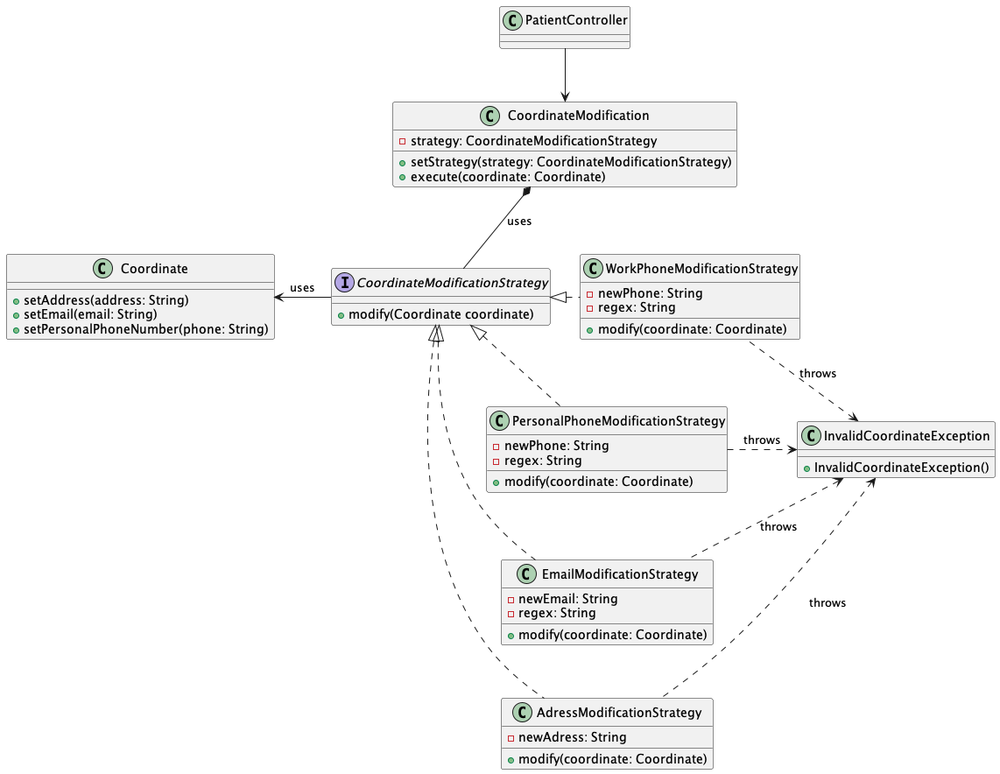

# Partie 2: Introduction des Patrons de Conception

## Équipe 9

- Dominique Elias ELID14019800
- Emil Surkhaev SURE89080008
- Youenn Pierre-Justin PIEY78070308
- Keven Jude Anténor ANTK08129003

### Informations du cours

- **Cours :** INF5153 groupe 30
- **Titre :** Génie logiciel: conception
- **Professeur :** Gnagnely Serge Dogny
- **Date :** 8 Avril 2024

## Table de contenu

1. [Facade-Observer](#facade-observer)
2. [Singleton](#singleton)
3. [Strategy](#strategy)
4. [Template](#template)

## Facade-Observer

Par Dominique Elias

### Diagramme de Classe


### Diagramme de Séquence

Patron `Facade`, utiliser principalement pour découpler la classe `MedicalFile` de l'interface de l'`Observer`.


Patron `Observer`, on montre trois exécutions de la méthode setMedicalFile de la classe `MedicalFileFacade` qui notifie les `Observers`.
Avant la première exécution, l'`Observer` `ModificationObserver` est instancié et ajouté à la liste des `Observers` de `MedicalFileFacade`.
Ensuite, lors de l'exécution de la méthode `setMedicalFile`, l'`Observer` `ModificationObserver` est notifié et mis à jour automatiquement.
On instancie un autre `Observer` `EmailObserver` et il s'ajoute à la liste des `Observers` de `MedicalFileFacade`.
Quand on exécute la méthode `setMedicalFile` une deuxième fois, les deux `Observers` sont notifiés et mis à jour automatiquement.
L'`Observer` `ModificationObserver` décide de ne plus être notifié et il est retiré de la liste des Observers de `MedicalFileFacade` avec la méthode `detach()`.
Donc lors de la troisième exécution de la méthode `setMedicalFile`, seul l'`Observer` `EmailObserver` est notifié et mis à jour automatiquement.


### Implémentation

Le patron `Observer` est utilisé pour permettre à un objet de la classe `ModificationObserver` d'être notifié et mis à jour automatiquement lorsqu'un objet `medicalFileFacade` (Subject) dont il dépent change d'état.

Rappel (partie1) : La classe `Modification` sert à sauvgarder les modifications apportées à un `medicalFile` dans la base de données `Archive`.

Donc lorsqu'un objet `MedicalFile` change d'état, l'objet `ModificationObserver` est notifiée et mise à jour automatiquement à travers un objet `medicalFileFacade`, et les modifications sont sauvegardées dans la base de données.

Ce Patron offre aussi la flexibilité de pouvoir ajouter d'autres classes Observers qui dépendent de `medicalFileFacade` sans avoir à modifier la classe.

Par exemple, si on veut ajouter une classe qui envoie un courriel à un médecin lorsqu'un `medicalFile` est modifié, on peut le faire en ajoutant une classe `EmailObserver` qui réalise (implements) `Observer`, sans avoir à modifier `medicalFileFacade`.

On sert du patron `Facade` ici pour garder la classe `MedicalFile` indépendante de l'interface de l'`Observer`. Mais aussi à limiter les méthodes de `MedicalFile` qui peuvent être appelées par les `Observers`.

### Problèmes de Conception et Corrections

- **Problème de Conception :** D'abord, on a pas utilisé le patron `Facade` pour simplifier l'interface de sous-système `MedicalFile` et découpler de l'interface de l'`Observer`.
- **Correction :** Donc on a corrigé ce problème en ajoutant la classe `MedicalFileFacade` qui sert d'interface unifiée pour les classes `Observers`.

### Différences entre l'implémentation et la conception

- **Différence :** Dans `ModificationObserver`, la méthode `archive()` affiche un message à la console pour simuler l'archivage des modifications dans la base de données.
Cependant, on peut toujours l'implémenter lorsque l'interface de la RAMQ est disponible.
Pour vérifier que l'`Observer` est notifié et mis à jour automatiquement, on affiche un message à la console.
Voici une capture d'écran de la console après mettre à jour un medical file :


Note: Vous pouvez vérifier vous même en ajoutant ou supprimant des medical visit sur le site web(frontend).

C'est recommandé de commenter cette ligne dans `application.properties` pour ne pas afficher les requêtes SQL dans la console.

```properties
spring.jpa.show-sql=true
```

### Définitions des patrons de conception

- Intention de l'`Observer` : Définir une interdépendance de type un-à-plusieurs, de façon que quand un objet change d'état, tous ceux qui en dépendent en soient notifiés et automatiquement mis à  jour.
- Intention de la `Facade` : Fournit une interface unifiée, à l'ensemble des interfaces d'un sous-système. La façade fournit une interface de plus haut niveau, qui rend le sous-système plus facile à utiliser.

## Singleton

Par Emil Surkhaev

### Diagramme de Classe



### Diagramme de Séquence



### Implémentation

Le patron `Singleton` est utilisé pour s'assurer qu'une seule instance du service `JwtService` est créée et utilisée dans toute l'application SantéConnect.
Cette instance unique gère la création et la validation des JWT tokens utilisés pour l'authentification des utilisateurs.
Le `Singleton` est particulièrement important pour le service de jetons JWT car il doit conserver une configuration cohérente et sécurisée pour la signature, la création et la vérification des jetons.
la classe `JwtService` est un singleton car spring boot crée une seule instance pour chaque classe annotée avec `@Component`.
On a ajouté `@scope("singleton")` pour s'assurer que spring boot crée une seule instance de `JwtService` pour toute l'application.
Notez que c'est la valeur par défaut de `@Component` mais on l'a ajouté pour plus de clarté.

### Problèmes de Conception et Corrections

- **Problème de Conception :** Sans le patron `Singleton`, plusieurs instances du `JwtService` pourraient être créées, introduisant le risque d'incohérence dans la gestion des jetons et potentiellement des failles de sécurité.
- **Correction :** En implémentant le `Singleton`, nous nous assurons que `JwtService` est instancié une seule fois, maintenant l'intégrité et la cohérence du processus d'authentification.

### Différences entre l'implémentation et la conception

- **Différence :** L'ancienne implementation de la classe `JwtService` utilisait l'implementation classique d'un `Singleton` pour créer une instance unique, avec un constructeur privé et une méthode statique pour obtenir l'instance unique. Ceci était moins flexible que l'implémentation actuelle avec `@Component`, qui est plus simple et plus conforme aux standards de Spring Boot.

### Définitions des patrons de conception

- Intention de l'`Singleton` : Assurer qu'une classe n'ait qu'une seule instance et fournir un point d'accès global à cette instance.

## Strategy
Par Youenn Pierre-Justin

### Diagramme de Classe



### Diagramme de Séquence


### Implémentation

Le patron Strategy est utilisé pour gerer la modification des coordonnees du patient. En effet lorsque l'utilisateur modifie une coordonnee, il s'occupe de la validation de la coordonnee en fonction du type de coordonnees et donc par extension de la strategie associe a cette coordonnee.

### Problèmes de Conception et Corrections

- **Problème de Conception :** Sans le patron `Strategy`, ce serait alors la responsibilité du controleur ou du service de gerer la logique d'affaire associé a la modification d'un coordonnee.
- **Correction :** En implémentant le `Strategy pattern`, on attribut clairement la responsibilité de la validation aupres de la strategy adaptee a la coordonnees modifiee

### Définitions des patrons de conception

- Intention de `Strategy pattern` : Permet de creer une famille d'algorithme, les mettres dans des classes separees et rendre leurs objet interchangeable. Il remplace l'heritage par une composition

## Template

### Diagramme de Classe


### Diagramme de Séquence

On montre ici un exemple de l'utilisation du patron `Template` pour les routes GET, POST, DELETE dans le contrôleur `MedicalFileController`.
On remarque que chaque route possède des opérations communes, `execute(id)`, mais avec des opérations spécifiques à chaque route.


### Implémentation

On utilise le patron de conception `Template` pour faciliter la gestion des routes GET, POST, DELETE etc. dans le contrôleur `MedicalFileController`.
Enfaite chaque route possède des opertions communes, comme la vérification si medicalFile existe, mais avec des opération spécifiques a chaque route.
Par example, la route POST doit mettre à jour un medicalFile, alors que la route GET doit retourner un medicalFile.
Les deux routes doivent vérifier si le medicalFile existe, mais avec des opérations furutres différentes.

### Différences entre l'implémentation et la conception

Aucune différence entre l'implémentation et la conception.

### Problèmes de Conception et Corrections

Avant l'utilsation du patron `Template`, chaque route avait des opérations communes dupliquées. Ceci cause l'anti-pattern Duplicated Code.
Avec le patron `Template`, on a pu réduire la duplication de code et rendre le code plus lisible et maintenable.
